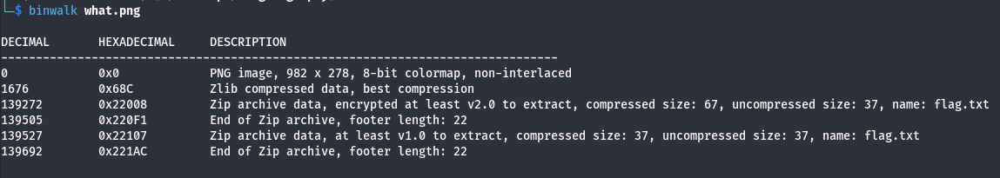
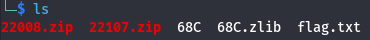

# Где же флаг?
Мы получаем картинку с художеством в пейнте. Слева снизу мы можем увидеть фейковый флаг, но настоящий скрывается в глубине картинки. 

Попробуем с помощью инструмента binwalk посмотреть скрытое содержимое, и возможно файлы, которые могут быть вшиты в картинку.
```binwalk what.png```
 

Видим помимо png какие-то zip архивы и прочие файлы, давайте извлечем все это в отдельную папку.
```binwalk -e what.png```


Тут и лежит наш заветный флаг.
