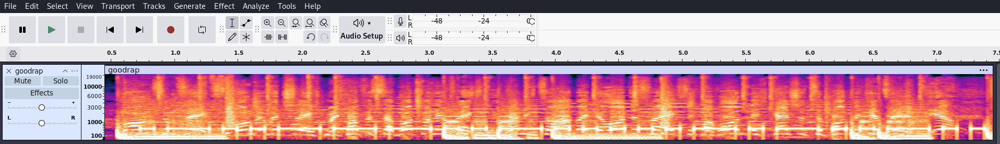

# Разминка

Мы получаем файл .wav с треком на немецком языке, но помимо основной мелодии также слышны короткие и длинные сигналы, которые похожи на скрытое сообщение.
Откроем файл в программе ```audacity``` для более четкого выделения сигналов от основной мелодии. Выберем режим спектограммы.

Помехи присутствуют, но можно выделить четкие сигналы и промежутки между ними.
Изначально все подумали, что это простая морзянка, и начали пытаться перевести ее в текст. Но в этих сигналах нет задержки между словами, что делает невозможным конвертирования их в текст по азбуке Морзе.

Если внимательно просмотреть спектограмму, можно увидеть, что расстояния между сигналами не равны. Есть строго 2 вида - короткие сигналы и длинные сигналы. Один из классических методов криптографии - это скрытие информации в бинарном виде. Если подставить вместо коротких сигналов ноль, а вместо длинных - единицу, то получится байт код, который спокойно конвертируется в флаг.

Во время соревнований участникам был дан следующий хинт, так как никто не смог решить таску без него:
> Но дружбы нет и той меж нами.  
> Все предрассудки истребя,  
> Мы почитаем всех нулями,  
> А единицами — себя.   

Из этого можно сделать вывод, что представленные сигналы - это не азбука морзе, а нолики и единички - то есть бинарь.
