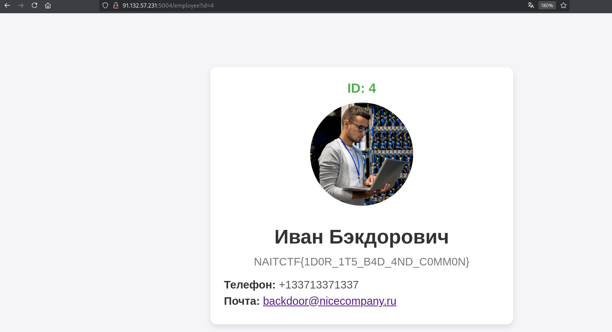

# Admin_IDOR

Из названия задания можно сделать вывод, что стоит искать уязвимость типа **IDOR** - Insecure Direct Object Reference, позволяющую получить недоступную информацию из-за проблем с разграничением доступа.

На сайте мы видим список всех работников, кроме системного администратора, которого нам нужно найти. Они кликабельные, и по нажатию открывается личный профиль сотрудника с ручкой `/employee?id`. В профиле у каждого сотрудника есть свой личный ID.

  

Просмотрев все профили, понимаем, что ID идут от 1 до 6, пропуская 4. Попробуем подставить его в параметр `id` и открываем профиль системного администратора, в котором лежит флаг.

