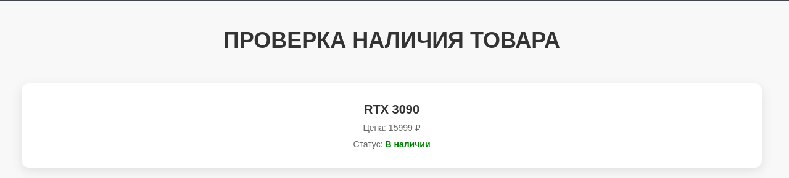
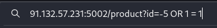
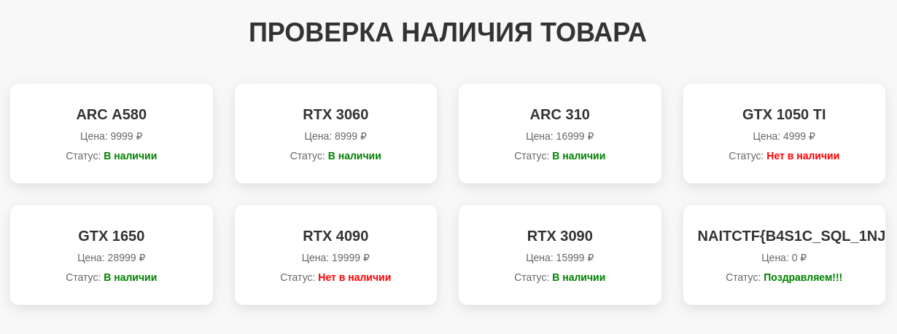

# Загадочный магазин

При переходе на сайт видим каталог видеокарт с описанием и ценами. Если нажать на любую из них, то откроется страница `/product` с параметром `id`, равным `id` видеокарты. Изучив сайт, можно понять, что это единственный функционал на нем, а значит, искать уязвимости нужно именно там.




При виде параметра, который пользователь может изменить, возникает желание попробовать IDOR (Insecure Direct Object Reference) уязвимость. Но, даже перебрав множество `id`, мы так и не сможем найти нужный.

Для решения этой задачи стоит применить одну из базовых Web уязвимостей — SQLi (SQL Injection). Дело в том, что видеокарты на бэкенде хранятся в базе данных, откуда они извлекаются следующим запросом:

```sql
SELECT * FROM products WHERE id = {keyword}
```
где keyword — это id товара. Ввод пользователя никак не фильтруется, поэтому можно попробовать извлечь все товары из базы данных, изменив структуру запроса.

Если изучить пейлоады и понять синтаксис SQL, можно закрыть текущий запрос и дописать новое условие, которое будет всегда правдой, а значит все товары извлекутся.

Например, введем в поле id следующее:
```sql
-5 OR 1 = 1
```


Это успешно подставится в SQL запрос, и к базе данных он придет уже таким:
```sql
SELECT * FROM products WHERE id = -5 OR 1 = 1
```
Запрос теперь буквально расшифровывается как: "Запросить ВСЁ из базы данных products, где id = -5 (такой id не существует, условие неверное) или 1 = 1 (верно всегда)", и мы получаем все товары из базы данных.


