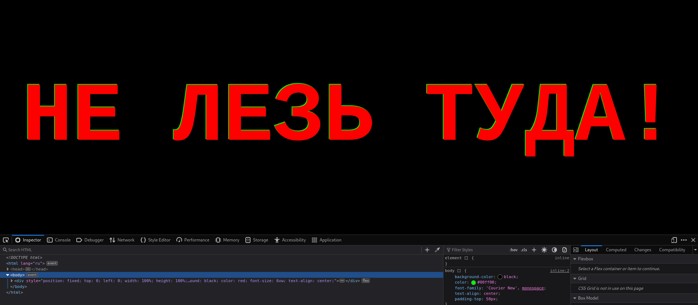
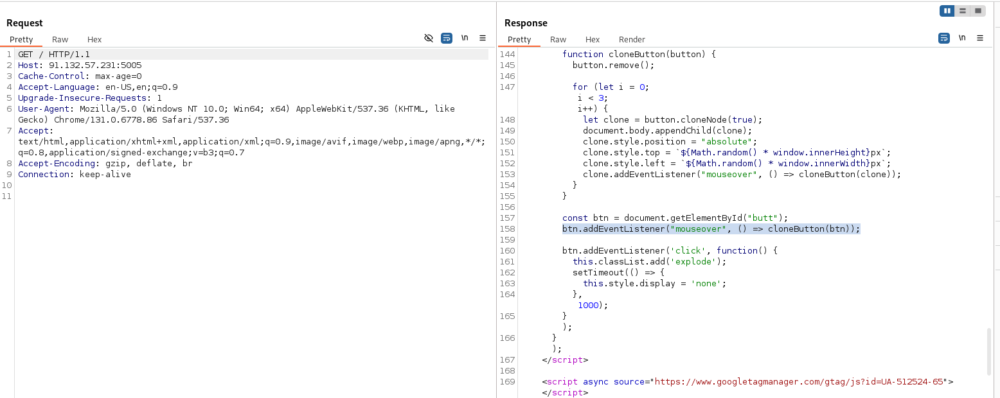
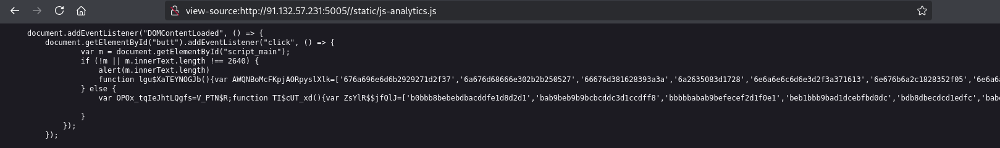
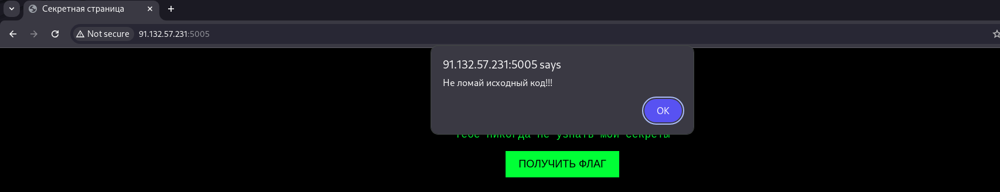
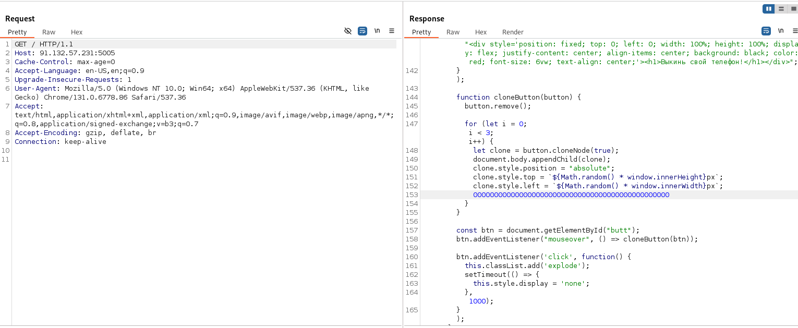

# Разминка REVENGE

Наш уже неюный разработчик вернулся с местью, уверяя, что надежно спрятал флаг, и теперь нам его не достать. Но он опять допустил свою главную ошибку — хранил флаг на клиенте, а не на сервере.

Зайдя на сайт, нас сразу встречает кнопка "Получить флаг", но при наведении на нее она исчезает, а ее клоны появляются в случайных местах. Использовать инструменты разработчика мы не можем, ведь при нажатии на F12 происходит следующее:

Но мы можем проанализировать исходный HTML, нажав Ctrl + U и открыв его в новой вкладке.

В коде мы видим проверку на размер окна, которая как раз и мешает нам открыть инструменты разработчика, а также код, отвечающий за клонирование кнопки при наведении на нее и закомментированный скрипт с названием js-analytics.

На самом деле у задания несколько вариантов решений. Я распишу те, которые пришли мне в голову.

1) Попробуем обойти проверку кнопки, удалив из кода строки, содержащие "mouseover", ведь они явно отвечают за действия мыши. Для этого нужно перехватить приходящий с сервера респонс, используя BurpSuite или другие инструменты для аудита веб-сайтов.

    

    Теперь мы можем нажать на кнопку, но она просто исчезает, и флаг мы так и не получаем. Нужно разобраться, почему.

    Ранее мы заметили закомментированный скрипт js-analytics, давайте посмотрим, что в нем.

    

    Мы видим вызов какой-то функции, когда происходит клик по кнопке, а дальше идет проверка длины основного скрипта, и если она не равна 2640, то выполняется какой-то обфусцированный код, то есть нечитаемый. В противном случае выполняется другой обфусцированный код.

    Давайте еще раз перехватим ответ сервера, раскомментируем этот скрипт и уберем проверку наведения на кнопку.

    

    Мы видим алерт с текстом "Не ломай исходный код". Наверное, это связано с той самой проверкой на длину, которая была в скрипте js-analytics, и как только мы его раскомментировали, она начала действовать. Но ведь если проверяется всего лишь длина скрипта, а не его точное соответствие, то мы можем просто изменить его, удалив проверку на мышь, но при этом сохранив количество символов.

    Например, удалим строку, отвечающую за наведение на кнопку, и добавим столько же нулей или любых других символов в скрипт, чтобы его длина сохранялась (либо ее можно просто закомментировать, комментарии не считаются за текст).

    

    Теперь попробуем нажать на кнопку — проверка не сработала, и мы успешно получили флаг!

2) Однако был способ легче. Когда мы нашли обфусцированные части кода в js-analytics.js, мы спокойно могли скомпилировать их в любом компиляторе JS, ведь если код не читаем для человека, это не значит, что он невозможен к исполнению. Запустив первый обфусцированный кусок, мы бы увидели предупреждение "Не ломай исходный код", а запустив второй — получили бы флаг.

Предлагайте свои интересные варианты решения, самые лучшие внесем в райтап!
